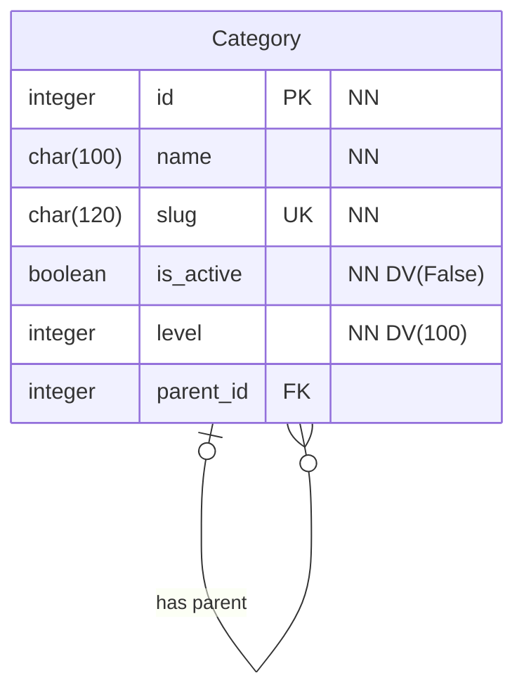

# fastAPI-learning-project

```mermaid
erDiagram
    Category {
      integer id PK "NN"
      char(100) name "NN"
      char(120) slug UK "NN"
      boolean is_active "NN DV(False)"
      integer level "NN DV(100)"
      integer parent_id FK
    }

    Category |o--o{ Category : "has parent"
```
