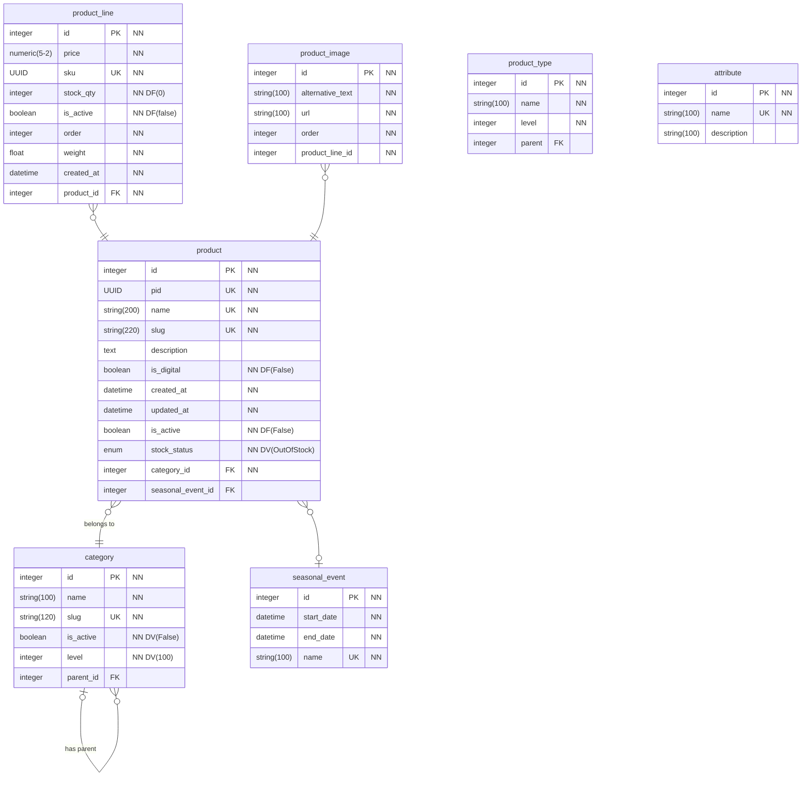

# fastAPI-learning-project

```mermaid
erDiagram
    category {
      integer id PK "NN"
      string(100) name "NN"
      string(120) slug UK "NN"
      boolean is_active "NN DV(False)"
      integer level "NN DV(100)"
      integer parent_id FK
    }

    product {
      integer id PK "NN"
      UUID pid UK "NN"
      string(200) name UK "NN"
      string(220) slug UK "NN"
      text description
      boolean is_digital "NN DF(False)"
      datetime created_at "NN"
      datetime updated_at "NN"
      boolean is_active "NN DF(False)"
      enum stock_status "NN DV(OutOfStock)"
      integer category_id FK "NN"
      integer seasonal_event_id FK
    }

    product_line {
      integer id PK "NN"
      numeric(5-2) price "NN"
      UUID sku UK "NN"
      integer stock_qty "NN DF(0)"
      boolean is_active "NN DF(false)"
      integer order "NN"
      float weight "NN"
      datetime created_at "NN"
      integer product_id FK "NN"
    }

    product_image {
      integer id PK "NN"
      string(100) alternative_text "NN"
      string(100) url "NN"
      integer order "NN"
      integer product_line_id "NN"
    }

    product_type {
      integer id PK "NN"
      string(100) name "NN"
      integer level "NN"
      integer parent FK
    }

    seasonal_event {
      integer id PK "NN"
      datetime start_date "NN"
      datetime end_date "NN"
      string(100) name UK "NN"
    }

    attribute {
      integer id PK "NN"
      string(100) name UK "NN"
      string(100) description
    }

    category |o--o{ category : "has parent"
    product }o--|| category: "belongs to"
    product }o--o| seasonal_event: ""
    product_line }o--|| product: ""
    product_image }o--|| product: ""

```
